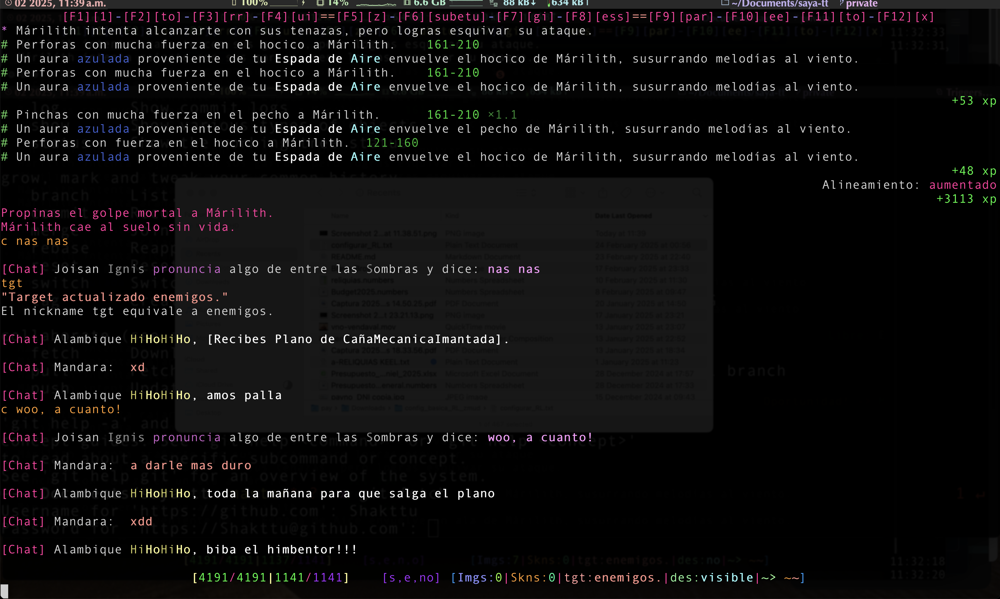
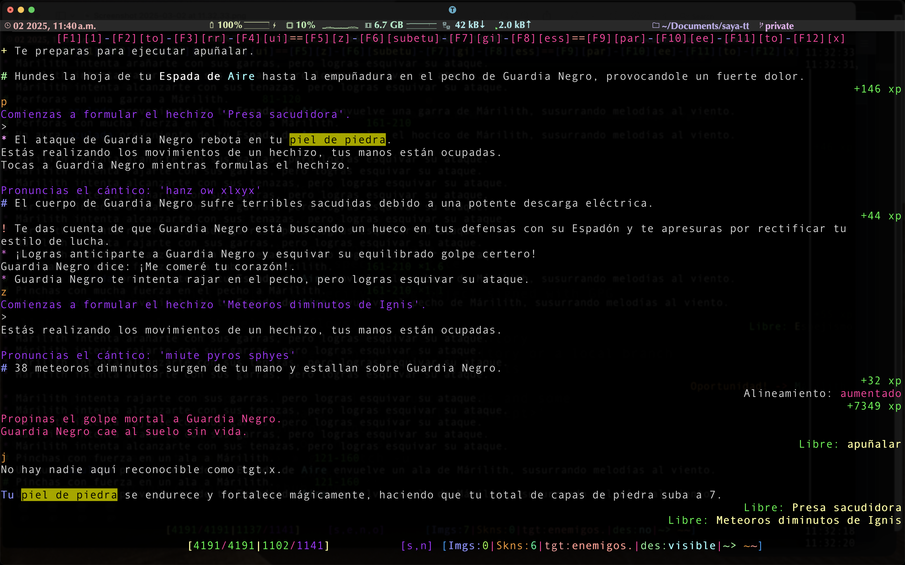

# saya-tt
Conjunto de configuraciones modulares para jugar a Reinos de Leyenda.

A diferencia del trabajo de Dunkelheit (rl-plus-plus), del que he usado buena parte, esta configuracion hace uso de configuracion local de tintin++ para alias de hechizos, comandos, etc, vs. tener alias y nicks en la ficha en el servidor.

Tambien implementa una barra de macros de Fn encima del estado, asi como un item llamado Caza que equivale el nick $target (usado en comandos de 1 solo nick, como seguir, comandos de invocaciones, etc)

## Estructura de ficheros
La forma de ejecutar esto es

```
tt++ -r config.tin pjs/tupj.tin
```

Una vez te hayas creado ese archivo, a partir del ejemplo. 

## Archivo de contrasenya para loging automatico
Has de crearte un archivo de contrasenya, llamarlo .password, y guardarlo en este mismo directorio. Dentro ha de contenter>
```
#var pass {mipasaswd};
```

### Arbol de directorios:
#### classes de configuracion
```
cooldowns.tin
effects.tin
formatting.tin
functions.tin
gmcp_handler.tin
lang_handler.tin
numpad.tin
pathdir.tin
prompts.tin
saving_throw.tin
spell_effects.tin
spells.tin
```

#
#

Shaktty.
